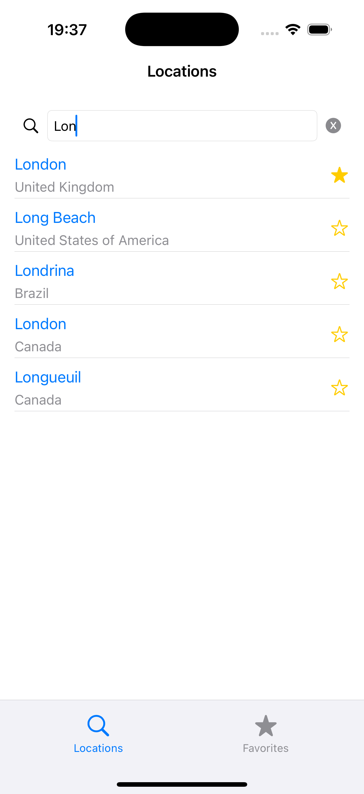
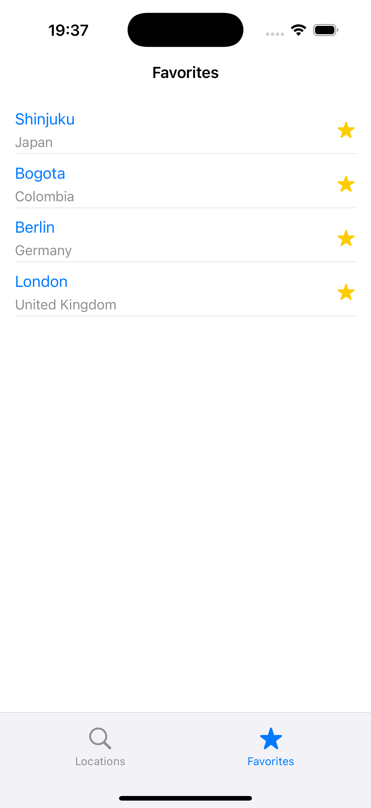
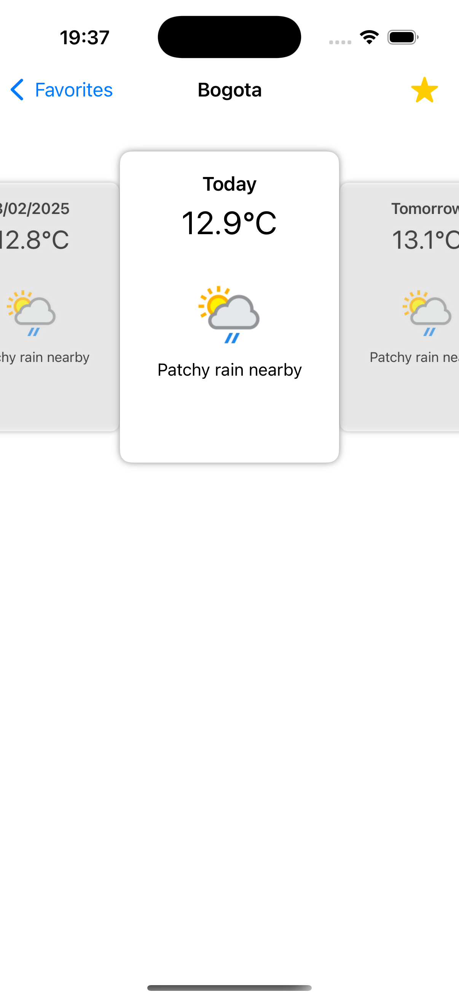

# WeatherApp

¡Bienvenido a **WeatherApp**! Esta es una aplicación simple y elegante que te permite buscar ubicaciones, ver el pronóstico del tiempo y guardar tus ubicaciones favoritas. La aplicación utiliza la API de [WeatherAPI](https://www.weatherapi.com/) para obtener datos meteorológicos en tiempo real.

---

## Funcionalidades Principales

### 1. **Búsqueda de Ubicaciones**
- Ingresa el nombre de una ciudad o ubicación en la barra de búsqueda.
- Los resultados se muestran automáticamente a medida que escribes.
- Cada resultado muestra el **nombre de la ubicación** y el **país**.

### 2. **Pronóstico del Tiempo**
- Al seleccionar una ubicación, se muestra una pantalla con el pronóstico del tiempo para los próximos 3 días, incluyendo el día actual.
- La información incluye:
  - **Nombre de la ubicación**.
  - **Temperatura promedio** en grados Celsius.
  - **Estado del clima** (texto e ícono gráfico).

### 3. **Ubicaciones Favoritas**
- Puedes guardar ubicaciones como favoritas para acceder rápidamente a su pronóstico.
- Las ubicaciones favoritas se almacenan localmente en el dispositivo usando **CoreData**.
- Desde la sección de favoritos, puedes eliminar ubicaciones guardadas.

---

## Requisitos del Sistema

- **Xcode 16 o superior**.
- **iOS 14 o superior**.
- Una cuenta en [WeatherAPI](https://www.weatherapi.com/) para obtener una clave de API.

---

## Instrucciones para Construir la Aplicación

Sigue estos pasos para configurar y construir la aplicación en tu entorno de desarrollo:

### 1. **Clonar el Repositorio**
Clona este repositorio en tu máquina local:
```bash
git clone https://github.com/jorge-bobrek/WeatherAPP.git
cd WeatherApp
```

### 2. **Configurar el Equipo de Desarrollo**
1. Abre el proyecto en Xcode.
2. Selecciona el archivo del proyecto en el navegador de Xcode.
3. Ve a la pestaña **Signing & Capabilities**.
4. En **Team** selecciona tu equipo de desarrollo de Apple.

### 3. **Configurar la Clave de API**
1. En el proyecto, localiza el archivo `Config.plist`.
2. Reemplaza `YOUR API KEY HERE` con tu clave de API de WeatherAPI:
   ```xml
   <key>APIKey</key>
   <string>YOUR API KEY HERE</string>
   ```
3. Guarda el archivo.

### 4. **Ejecutar la Aplicación**
1. Selecciona un dispositivo o simulador en Xcode.
2. Presiona **Cmd + R** para construir y ejecutar la aplicación.

---

## Uso de la API de WeatherAPI

La aplicación utiliza la API de [WeatherAPI](https://www.weatherapi.com/) para obtener datos meteorológicos. Asegúrate de registrarte en su sitio web para obtener una clave de API gratuita.

### Endpoints Usados
- **Búsqueda de Ubicaciones**: [Search API](https://www.weatherapi.com/docs/#apis-search)
- **Pronóstico del Tiempo**: [Forecast API](https://www.weatherapi.com/docs/#apis-forecast)

---

## Capturas de Pantalla

| Búsqueda de Ubicaciones | Ubicaciones Favoritas | Pronóstico del Tiempo |
|-------------------------|-----------------------|------------------------|
|  |  |  |


---

## Licencia

Este proyecto está bajo la licencia MIT. Consulta el archivo [LICENSE](LICENSE) para más detalles.

---

¡Gracias por usar **WeatherApp**! 🌦️